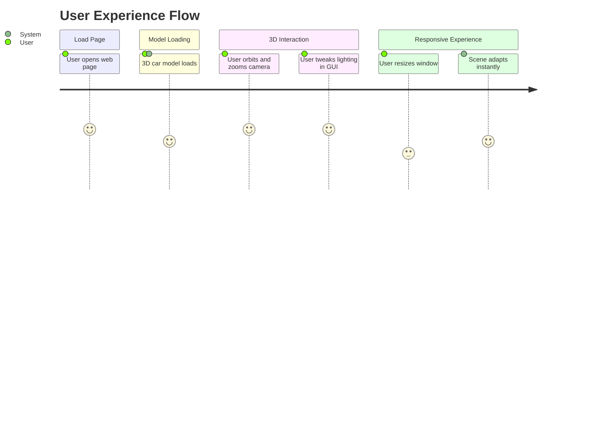
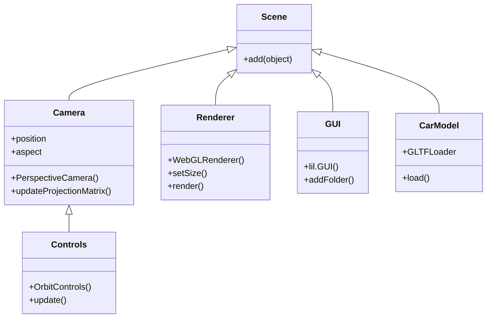

# Three.js Interactive Car Model Viewer 🚗

This project is a **Three.js-based 3D car model viewer** with interactive lighting controls and orbit camera, designed for the web. The application loads a `.glb` car scene, renders it in a WebGL canvas, and provides a user-friendly GUI for adjusting scene lighting properties. The following documentation covers the two main files: `index.html` and `main.js`.

---

## index.html

This file sets up the **web page structure**, loads all required libraries, and provides the canvas for rendering the 3D content.

### Purpose

- Creates a full-screen canvas for Three.js rendering.
- Loads external scripts for Three.js, model loaders, controls, and GUI.
- Ensures the viewer is styled for a seamless, immersive experience.

### Key Components

| Element / Resource                      | Purpose                                                         |
|-----------------------------------------|-----------------------------------------------------------------|
| `<canvas id="draw">`                    | Target for Three.js renderer                                    |
| three.min.js                            | Core Three.js rendering engine                                  |
| GLTFLoader.js, RGBELoader.js            | Model and HDR environment loaders                               |
| OrbitControls.js                        | Enables interactive orbit camera controls                       |
| lil-gui.umd.min.js, lil-gui.min.css     | GUI library for live scene/light controls                       |
| main.js                                 | Main application logic (see below)                              |

### HTML Structure

```html
<!DOCTYPE html>
<html lang="en">
<head>
  <meta charset="UTF-8">
  <meta name="viewport" content="width=device-width, initial-scale=1.0">
  <title>Document</title>
  <style>
    * { margin: 0; padding: 0; }
    html, body { width: 100%; height: 100%; background: black; overflow: hidden; }
    canvas { display: block; width: 100vw; height: 100vh; }
  </style>
</head>
<body>
  <canvas id="draw"></canvas>
  <!-- Three.js & Plugins -->
  <script src="https://cdnjs.cloudflare.com/ajax/libs/three.js/r128/three.min.js"></script>
  <script src="https://cdn.jsdelivr.net/npm/three@0.128.0/examples/js/loaders/GLTFLoader.js"></script>
  <script src="https://cdn.jsdelivr.net/npm/three@0.128.0/examples/js/loaders/RGBELoader.js"></script>
  <script src="https://cdn.jsdelivr.net/npm/three@0.128.0/examples/js/controls/OrbitControls.js"></script>
  <!-- GUI -->
  <script src="https://cdn.jsdelivr.net/npm/lil-gui@0.21.0/dist/lil-gui.umd.min.js"></script>
  <link href="https://cdn.jsdelivr.net/npm/lil-gui@0.21.0/dist/lil-gui.min.css" rel="stylesheet">
  <!-- App -->
  <script src="main.js"></script>
</body>
</html>
```

#### Features

- **Full browser window usage:** Canvas fills the viewport for full immersion.
- **Black background:** Highlights the 3D content.
- **Zero margin/padding:** Ensures no unwanted page scroll or whitespace.
- **Library CDN usage:** No local Three.js or GUI dependencies, easy to run.

---

## main.js

This script implements the **3D scene logic**, including scene setup, camera, lights, car model loading, controls, and live GUI for real-time parameter tweaking.

### Purpose

- Initialize and render a 3D scene with a car model.
- Allow users to interact with the scene via orbit controls.
- Provide an intuitive GUI for adjusting light properties in real time.

### High-Level Workflow

```mermaid
flowchart TD
    A[Start] --> B[Create Scene & Camera]
    B --> C[Setup Renderer]
    C --> D[Add Lights]
    D --> E[Load Car Model (GLB)]
    E --> F[Enable Orbit Controls]
    F --> G[Setup GUI for Light Controls]
    G --> H[Render Loop (animate)]
    H --> I[Handle Resize & Mouse Move]
    I --> H
```

### Main Components

#### 1. **Scene and Camera Setup**

- **Scene:** Core container for objects and lights.
- **Camera:** Perspective view, positioned away from the model for optimal viewing.

```js
const scene = new THREE.Scene();
const camera = new THREE.PerspectiveCamera(75, window.innerWidth / window.innerHeight, 0.1, 1000);
camera.position.z = 400;
```

#### 2. **Renderer**

- **WebGLRenderer:** Draws the scene on the canvas.
- **Adaptive sizing:** Matches browser window size.

```js
const canvas = document.querySelector("#draw");
const renderer = new THREE.WebGLRenderer({ canvas: canvas });
renderer.setSize(window.innerWidth, window.innerHeight);
```

#### 3. **Lighting Setup**

- **Directional Lights:** Key and fill lighting for highlights and shadows.
- **Ambient Light:** General illumination.
- **Point Light:** Adds extra sparkle.

```js
const highIntensityLight = new THREE.DirectionalLight(0xffffff, 2);
highIntensityLight.position.set(-6.5, 20, -5.08);
scene.add(highIntensityLight);

const directionalLight = new THREE.DirectionalLight(0xffffff, 2);
directionalLight.position.set(0.64, 1.8, 10.16);
scene.add(directionalLight);

const ambientLight = new THREE.AmbientLight(0xffffff, 2);
scene.add(ambientLight);

const pointLight = new THREE.PointLight(0xffffff, 2, 100);
pointLight.position.set(20, 20, 0);
scene.add(pointLight);
```

#### 4. **3D Car Model Loading**

- Loads a `.glb` car scene using `GLTFLoader`.
- Adds the model to the scene upon load.
- Handles loading progress and errors.

```js
const loader = new THREE.GLTFLoader();
loader.load(
  'car_scene.glb',
  function (gltf) {
    object = gltf.scene;
    scene.add(object);
    console.log('Car loaded successfully');
  },
  function (xhr) {
    console.log((xhr.loaded / xhr.total * 100) + '% loaded');
  },
  function (error) {
    console.error(error);
  }
);
```

#### 5. **Controls**

- **OrbitControls:** Mouse-driven camera orbiting and zooming.

```js
controls = new THREE.OrbitControls(camera, renderer.domElement);
```

#### 6. **Animation Loop**

- Continuously updates controls and renders the scene.
- Keeps the display smooth and interactive.

```js
function animate() {
  requestAnimationFrame(animate);
  if (controls) { controls.update(); }
  renderer.render(scene, camera);
}
animate();
```

#### 7. **Responsive Resize**

- Adjusts camera aspect and renderer size on window resize.

```js
window.addEventListener("resize", function () {
  camera.aspect = window.innerWidth / window.innerHeight;
  camera.updateProjectionMatrix();
  renderer.setSize(window.innerWidth, window.innerHeight);
});
```

#### 8. **Live GUI (lil-gui)**

- Lets users interactively tweak light intensities and positions.
- Each light has its own folder for organized control.

```js
const gui = new lil.GUI();

const ambientFolder = gui.addFolder('Ambient Light');
ambientFolder.add(ambientLight, 'intensity', 0, 2).name('Intensity');
ambientFolder.close();

const directionalFolder = gui.addFolder('Directional Light');
directionalFolder.add(directionalLight, 'intensity', 0, 2).name('Intensity');
directionalFolder.add(directionalLight.position, 'x', -20, 20).name('Position X');
directionalFolder.add(directionalLight.position, 'y', -20, 20).name('Position Y');
directionalFolder.add(directionalLight.position, 'z', -20, 20).name('Position Z');
directionalFolder.close();

const highIntensityFolder = gui.addFolder('High Intensity Light');
highIntensityFolder.add(highIntensityLight, 'intensity', 0, 2).name('Intensity');
highIntensityFolder.add(highIntensityLight.position, 'x', -20, 20).name('Position X');
highIntensityFolder.add(highIntensityLight.position, 'y', -20, 20).name('Position Y');
highIntensityFolder.add(highIntensityLight.position, 'z', -20, 20).name('Position Z');
highIntensityFolder.close();

const pointFolder = gui.addFolder('Point Light');
pointFolder.add(pointLight, 'intensity', 0, 2).name('Intensity');
pointFolder.add(pointLight.position, 'x', -20, 20).name('Position X');
pointFolder.add(pointLight.position, 'y', -20, 20).name('Position Y');
pointFolder.add(pointLight.position, 'z', -20, 20).name('Position Z');
pointFolder.close();
```

---

### Mouse Move Handling

Tracks mouse position, reserved for potential future interactivity or effects.

```js
document.onmousemove = (e) => {
  mouseX = e.clientX;
  mouseY = e.clientY;
}
```

---

### Features at a Glance

- **3D car model rendering** (GLTF format)
- **Real-time scene lighting controls**
- **Orbit camera for full model exploration**
- **Responsive layout** (handles window resize)
- **Modern, minimal interface**

---

## Typical User Journey



---

## Example Code Snippets

### Load and Add a Car Model

```js
const loader = new THREE.GLTFLoader();
loader.load('car_scene.glb', function (gltf) {
  object = gltf.scene;
  scene.add(object);
  console.log('Car loaded successfully');
});
```

### Add a Directional Light and GUI Control

```js
const directionalLight = new THREE.DirectionalLight(0xffffff, 2);
directionalLight.position.set(0.64, 1.8, 10.16);
scene.add(directionalLight);

const directionalFolder = gui.addFolder('Directional Light');
directionalFolder.add(directionalLight, 'intensity', 0, 2).name('Intensity');
directionalFolder.add(directionalLight.position, 'x', -20, 20).name('Position X');
directionalFolder.add(directionalLight.position, 'y', -20, 20).name('Position Y');
directionalFolder.add(directionalLight.position, 'z', -20, 20).name('Position Z');
directionalFolder.close();
```

---

## Project Architecture Diagram



---

## Key Takeaways

- The project demonstrates **modern 3D web rendering** using Three.js.
- It is an excellent template for **interactive model viewers** or product configurators.
- The code is fully client-side and requires only static hosting and a compatible `.glb` file.

```card
{
  "title": "Best Practice",
  "content": "Ensure your 'car_scene.glb' file is present in the project directory for the model to load."
}
```

---

## How to Use

1. Place your `car_scene.glb` file in the project root.
2. Open `index.html` in your browser.
3. Explore and tweak the car model and lighting using the interactive GUI!

---

## Troubleshooting

- If the car does not appear, check the browser console for model loading errors.
- Make sure all CDN links are accessible and not blocked by network policies.

---

## Further Improvements

- Add support for more models and materials.
- Enable saving/loading of lighting presets.
- Integrate environment maps for realistic reflections.

---

# 🎉 Enjoy exploring your car model in 3D!
